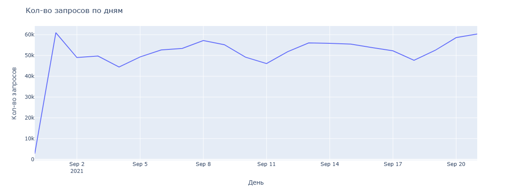
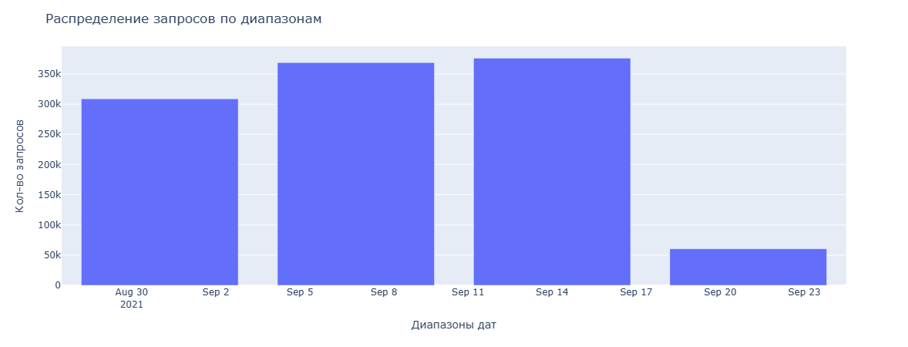
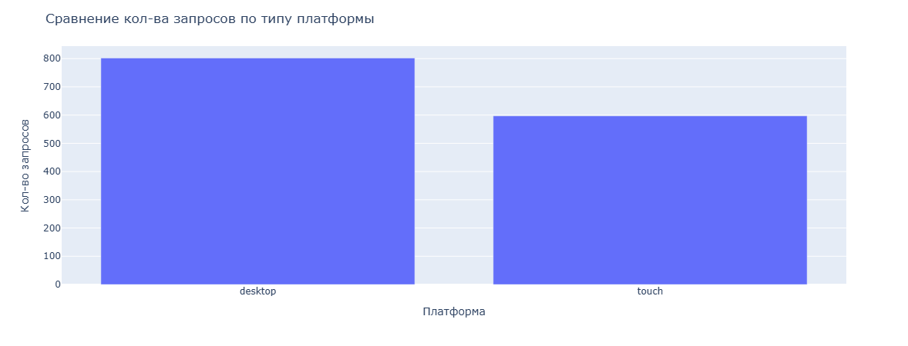
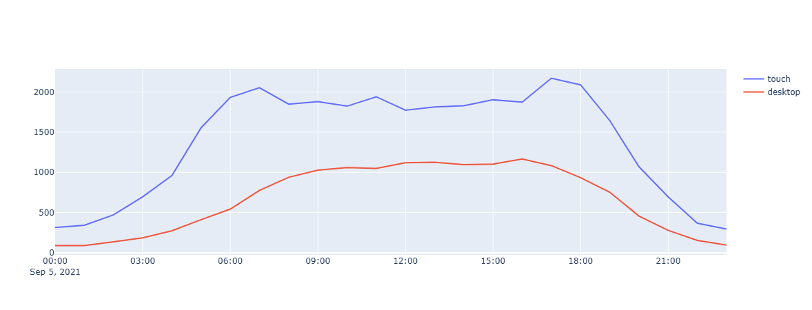
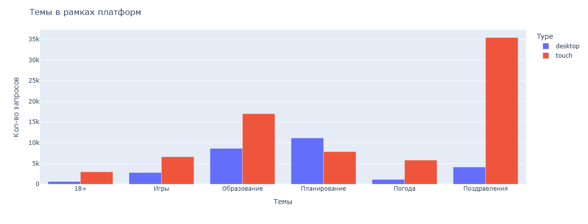

# Задача по анализу поиска в Яндекс Картинках

### Описание
В файле data.tsv лежит семпл запросов к Яндекс Картинкам за несколько недель.

Формат:

| Запрос | Дата и время | Тип устройства |
| --- | --- | --- |
| малевич картины | 2021-09-16 15:34:25 | desktop |
| психология | 2021-09-16 08:39:43 | touch |
| зверополис фильмы | 2021-09-16 10:19:59 | touch |

В файле **review.py** решены следующие вопросы:

1.	Рассмотрены даты диапазона, предоставленного для анализа;


2.	Рассчитано кол-во запросов с текстом "ютуб" в каждой платформе (desktop, touch);

3.	Отображены топ-10 самых частотных запросов в каждой платформе (desktop, touch);
4.	Проанализован трафик запросов в течении дня;

5.	Выделены тематики запросов, контрастные для мобильных устройств и компьютеров.


### Локальный запуск

Создание окружения:

```
python -m venv venv
```

Скачивание зависимостей:

```
pip install -r requirements.txt
```